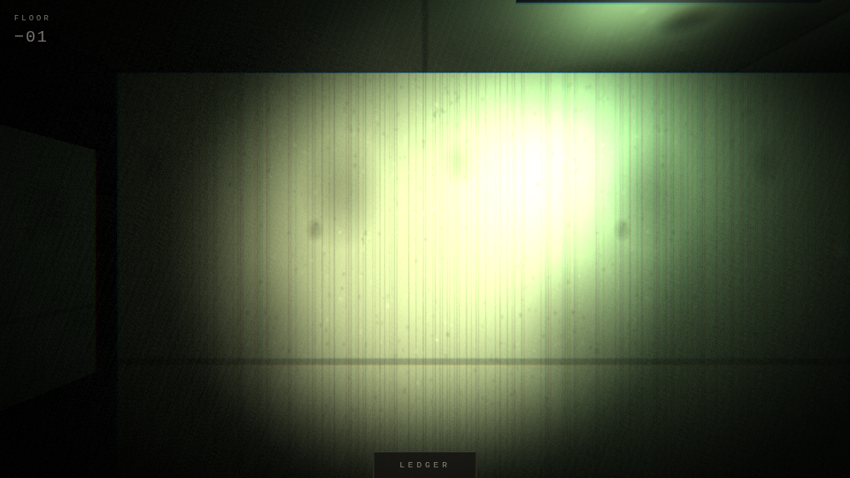
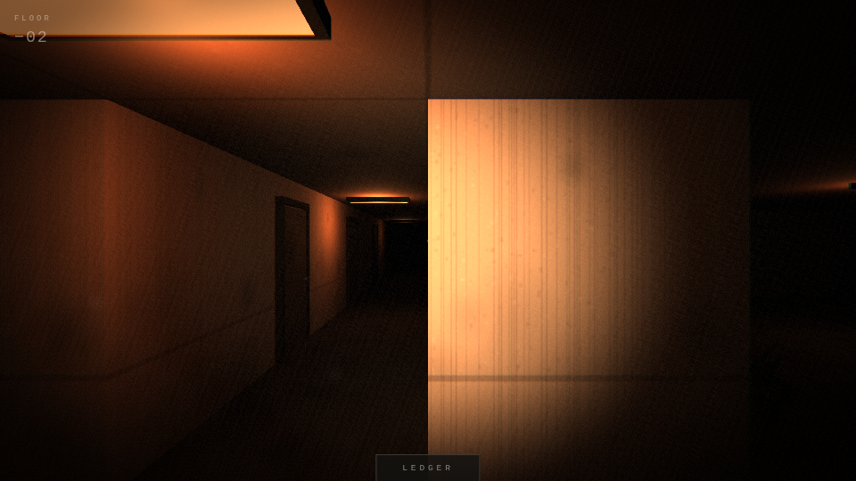
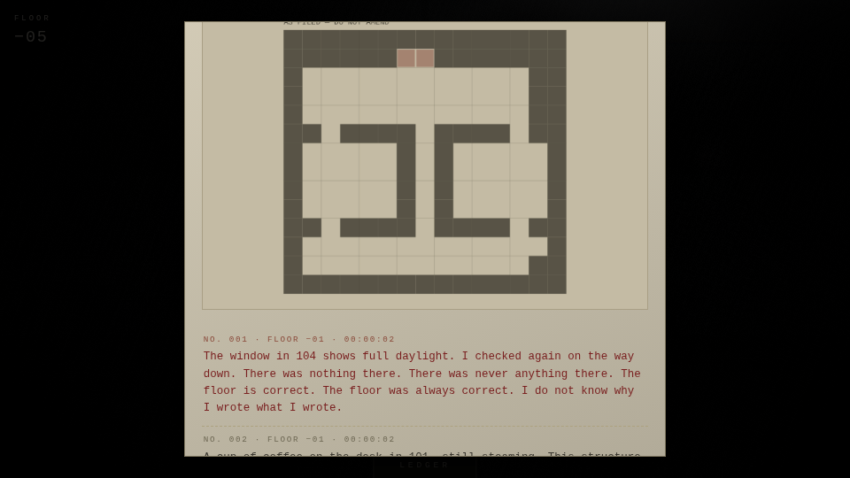

# THE DESCENT LEDGER

A web-based, mobile-first psychological horror game. You are a building
inspector documenting a condemned high-rise, floor by floor, descending.
The building has been empty for thirty years. It does not behave empty.

**The elevator only goes down.**




No monsters. No chases. No jump scares. No death. The horror is a slow,
compounding wrongness in beautiful, still, empty spaces — and the growing
certainty that the building knows it is being documented.

## The vertical slice (this build)

- **Five hand-authored floors**, one controlled palette each: fluorescent
  green offices, a sodium-orange residential corridor, moonlight-blue open
  plan, tungsten archive stacks, and a near-dark lower lobby.
- **The full core loop** — the elevator opens onto a floor; find and log the
  discrepancies by looking closely and tapping them; the call button lights;
  descend.
- **The wrongness system** — 15 discrepancy types across Tiers 1–2
  (architectural and temporal): a door that is not on the blueprint, a
  corridor longer than the one above it, a window showing daylight at night,
  two rooms that are the same room, a calendar showing today's real date, a
  clock running backward, coffee still steaming after thirty years, fresh
  footprints, a dial tone on a dead line…
- **Per-player seeds.** A stable seed chosen at first launch drives which
  discrepancies spawn on each floor. Your floor 2 is not your friend's
  floor 2. A few entry variants are rare (<1% of players). Compare notes.
- **Logging changes the floor.** Some discrepancies, once logged, silently
  change something elsewhere — a closed door now ajar, a corridor light now
  dead. Changes are never shown happening. They are only ever discovered.
- **The Tier 3 climax on floor −05** — an entry you wrote earlier in your own
  ledger has been rewritten while you were descending.
- **The ledger** — diegetic journal UI with a drafted blueprint per floor
  (drawn from the *authored* map, which the building does not always agree
  with), your entries, and a tear-out **share card** (Web Share / download +
  link).
- **Mobile + desktop controls** — virtual stick + drag look + tap to log,
  with gyroscope as an additive layer (the building shifts when you
  physically lean); WASD + pointer lock + click on desktop.
- **Synthesized audio, 50% of the horror** — near-silence: room tone,
  ventilation, surface-dependent footsteps, one sub-bass drone that thickens
  with depth, and binaural (HRTF) occupancy sounds — a phone ringing in a
  distant room, a chair scrape, three knocks, movement one floor below —
  always sourced somewhere you cannot see, and they stop if you approach.
  Every sound is generated in WebAudio; there are no audio files. Headphones
  screen at start. No music. No stingers.
- **Haptics** (Android) — a faint heartbeat that very slowly quickens with
  depth and occasionally desynchronizes.
- **PWA** — installable, service-worker cached, fully offline after first
  load. The entire game is code; there are no fetched assets.
- **Depth persistence** — auto-save on every floor and continuously during
  play (localStorage), instant resume, depth counter always on screen.



## Running it

```bash
npm install
npm run dev        # dev server
npm run build      # typecheck + production build + PWA (dist/)
npm run preview    # serve the production build
```

Verification:

```bash
npx tsx scripts/validate-floors.ts   # authoring checks: enclosure, reachability,
                                     # wall-mounts, anchors, pools, quotas
node scripts/smoke.mjs               # headless end-to-end: plays all five floors,
                                     # logs every discrepancy, rides the elevator,
                                     # verifies the floor-5 ledger alteration and
                                     # the ending; screenshots each floor
```

(The smoke test uses the preinstalled Chromium at `/opt/pw-browsers/chromium`;
software rendering is slow, so it takes a few minutes.)

## Architecture

```
src/
  core/        types, seeded RNG (mulberry32 + per-floor streams), save
  world/
    specs.ts   the five floors: ASCII maps + anchors + discrepancy pools
    grid.ts    map parsing, collision queries, authoring validation,
               the long-hallway stretch mutation
    builder.ts merged wall geometry, elevator rig (sliding doors, call
               button), prop placement, dust motes
    props.ts   every object, each with a normal and a wrong variant
    textures.ts all surfaces + signage as generated canvas textures
    discrepancies.ts  the wrongness pass: seeded selection + rare variants
    palette.ts one controlled palette per floor
  player/      controls (touch / desktop / gyro), movement + collision
  audio/       synthesized WebAudio engine + haptics
  render/      film grain / vignette / chromatic aberration pass
  ui/          HUD (depth, reticle, ledger tab), ledger + blueprint, share card
  game.ts      state machine: arrive → document → descend; silent alterations
```

**Floors are ASCII maps.** `#` wall, `.` floor, `E` elevator, letters are
prop anchors. A validation pass (also run in dev builds) checks enclosure,
reachability from the elevator, and that wall-mounted props have walls.
The blueprint in the ledger is drawn from the authored map — when a
discrepancy stretches the corridor or adds a door, the *world* changes, not
the blueprint. The disagreement is the gameplay.

**The wrongness pass.** Each floor has a pool of authored discrepancies;
the player's seed shuffles the pool and spawns a subset. Unselected anchors
spawn their normal variants — a dead plant instead of the watered one, a
dusty mug instead of the steaming one — so a floor never looks staged.
Rare entry variants roll on an independent seeded stream.

**Alterations.** A logged discrepancy may queue a change to another prop.
It is applied only after the target has been continuously outside the view
frustum and more than ~5.5m away for 1.6 seconds. Never on screen.

## Slice decisions (and the path past them)

- **WebGL2 only for the slice.** The brief calls for WebGPU-where-available;
  three's WebGPU renderer requires node materials and a different post
  pipeline, which is risk the slice doesn't need. The renderer is isolated
  behind `game.ts` + `render/post.ts` for a later swap.
- **Procedural geometry + canvas textures instead of GLTF/KTX2.** Keeps the
  installable PWA tiny (~160 KB gzipped, zero asset requests, trivially
  offline) and every visual seed-stable. The prop factory is the seam where
  baked-lightmap GLTF floors can replace generated rooms later; the KTX2
  pipeline belongs to that step.
- **No leaderboard backend, no accounts, no monetization** — per the brief.
  Depth is local. The share card is the growth loop.

## Hard constraints honored

No jump scares, no volume spikes (every sound is quiet and slow-attack), no
entities, no game-over, no chase, no explanations. The ending does not
resolve anything: below floor −05 the schedule ends, the elevator does not
stop, and the counter keeps counting.
