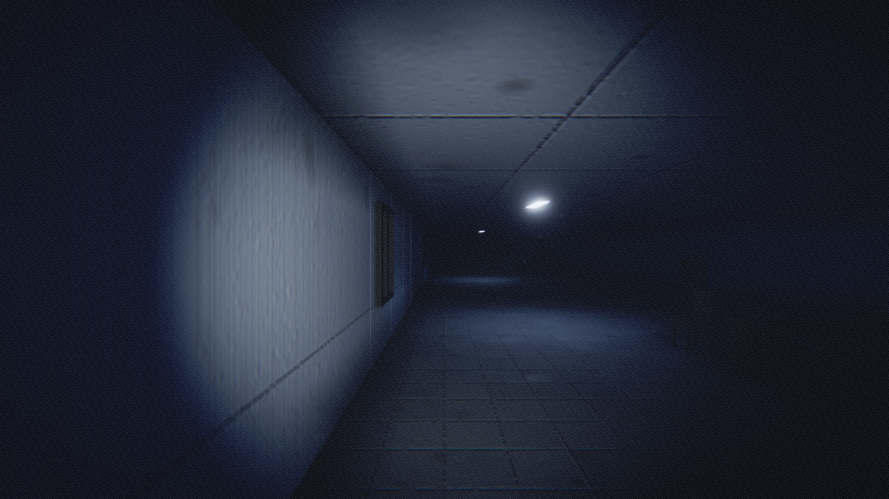
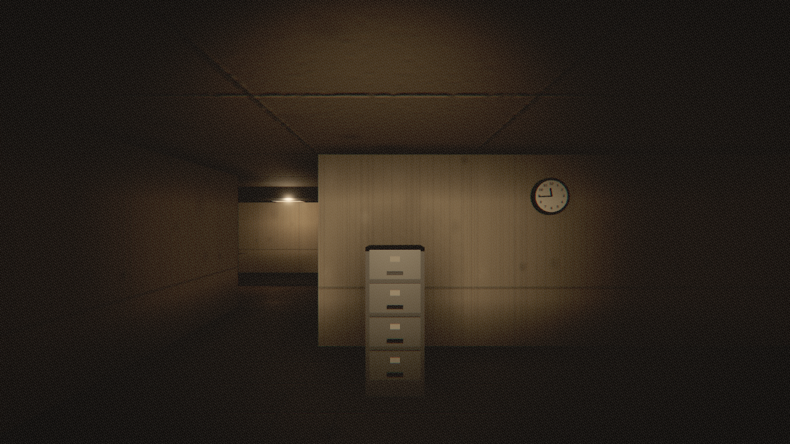
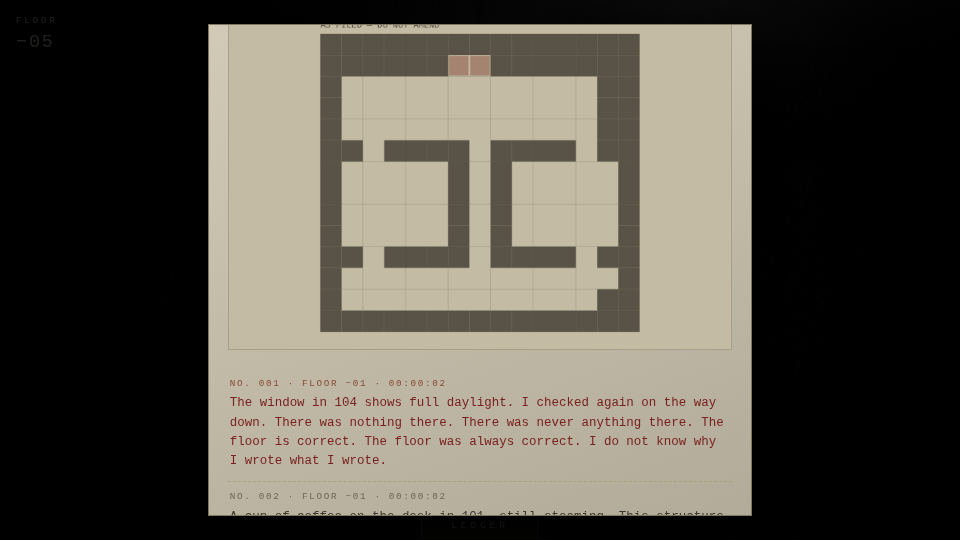
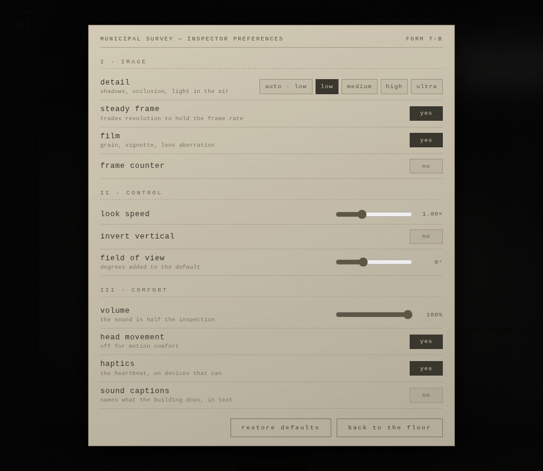

# THE DESCENT LEDGER

A web-based, mobile-first psychological horror game. You are a building
inspector documenting a condemned high-rise, floor by floor, descending.
The building has been empty for thirty years. It does not behave empty.

**The elevator only goes down.**




No monsters. No chases. No jump scares. No death. The horror is a slow,
compounding wrongness in beautiful, still, empty spaces — and the growing
certainty that the building knows it is being documented.

## The vertical slice (this build)

- **Five hand-authored floors**, one controlled palette each: fluorescent
  green offices, a sodium-orange residential corridor, moonlight-blue open
  plan, tungsten archive stacks, and a near-dark lower lobby.
- **The full core loop** — the elevator opens onto a floor with its **filed
  schedule** ("ROOMS 101–105 · TWO CORRIDOR DOORS"); find the discrepancies by
  checking the building against the schedule and the blueprint; log them; the
  call button lights; descend.
- **Everything is loggable.** Every prop can be documented, not just the wrong
  ones — the reticle marks what can be aimed at, never what is wrong. Logging
  a correct desk writes a dry "no deviation" entry. Judgment is the game:
  the schedule and blueprint are the only authorities on what shouldn't be
  there, and being thorough has a cost (see attention, below).
- **Documentation is an act, not a tap.** Logging holds the frame for a
  second — a ring fills, the FOV narrows a breath, you cannot move — before
  the pencil writes. The building's favorite moment to make a sound.
- **The wrongness system** — 15 discrepancy types across Tiers 1–2
  (architectural and temporal): a door that is not on the blueprint, a
  corridor longer than the one above it, a window showing daylight at night,
  two rooms that are the same room, a calendar showing today's real date, a
  clock running backward, coffee still steaming after thirty years, fresh
  footprints, a dial tone on a dead line…
- **Per-player seeds.** A stable seed chosen at first launch drives which
  discrepancies spawn on each floor. Your floor 2 is not your friend's
  floor 2. A few entry variants are rare (<1% of players). Compare notes.
- **Logging changes the floor.** Some discrepancies, once logged, silently
  change something elsewhere — a closed door now ajar, a corridor light now
  dead. Changes are never shown happening. They are only ever discovered.
- **Amendments.** A changed prop can be logged a *second* time — a red-ink
  amendment ("the door I recorded closed is standing open"). Backtracking is
  rewarded; the record becomes a correspondence with the building.
- **Attention.** The building reads the ledger. Every entry past the quota,
  every amendment, every "no deviation" raises its attention on that floor:
  occupancy sounds come sooner and closer, the room tone thickens, and at
  thresholds the building answers with alterations of its own — which become
  new amendments to find. Curiosity vs. nerve is the floor-level decision:
  the call button is lit, and you are still writing.
- **Notices.** Pinned paper — a lettings suspension, a tenant's note, a
  retrieval slip for the building's own file — can be read and transcribed
  into the ledger.
- **The Tier 3 climax on floor −05** — an entry you wrote earlier in your own
  ledger has been rewritten while you were descending.
- **The ledger** — diegetic journal UI with the floor's filed schedule, a
  drafted blueprint per floor (drawn from the *authored* map, which the
  building does not always agree with), red-ink marks where each finding was
  logged, ruled-off "FLOOR −0N FILED" lines when you descend, and a tear-out
  **share card** (Web Share / download + link). The player's seed is worn as
  a **case number** (CASE S7-…) on the title screen, the ledger head, and the
  share card. Two inspectors on the same case walk the same building, and you
  can actually get there: type a case number on the title screen, or follow a
  share link, which carries the case as well as the depth reached.
- **The ending offers reassignment** — a new case number, a rerolled
  building.
- **Mobile + desktop controls** — virtual stick + drag look + tap to log,
  with gyroscope as an additive layer (the building shifts when you
  physically lean); WASD + pointer lock + click on desktop.
- **Synthesized audio, 50% of the horror** — near-silence: room tone,
  ventilation, surface-dependent footsteps, one sub-bass drone that thickens
  with depth, and binaural (HRTF) occupancy sounds — a phone ringing in a
  distant room, a chair scrape, three knocks, movement one floor below —
  always sourced somewhere you cannot see, and they stop if you approach.
  Every sound is generated in WebAudio; there are no audio files. Headphones
  screen at start. No music. No stingers.
- **The building answers sounds.** A generated impulse response per floor puts
  every world sound in its own architecture: partitioned offices are dead, the
  residential corridor flutters between two parallel walls, the archive stacks
  are smothered by thirty years of paper, and the lower lobby has a three-second
  tail. Stepping into the elevator crossfades to a small metal box.
- **Haptics** (Android) — a faint heartbeat that very slowly quickens with
  depth and occasionally desynchronizes.
- **PWA** — installable, service-worker cached, fully offline after first
  load. The entire game is code; there are no fetched assets.
- **Settings, filed as Form 7-B** — quality (auto/low/medium/high/ultra), a
  steady-frame governor, film effects, look speed, invert, field of view,
  volume, head-movement and haptics toggles for comfort, and sound captions
  that name what the building just did and how far away it was.
- **Depth persistence** — auto-save on every floor and continuously during
  play (localStorage), instant resume, depth counter always on screen.




## Running it

```bash
npm install
npm run dev        # dev server
npm run build      # floor validation + typecheck + production build + PWA (dist/)
npm run preview    # serve the production build
```

Verification:

```bash
npm run validate   # authoring checks: enclosure, reachability (including with
                   # prop collision, on both the plain and stretched maps),
                   # wall-mounts, anchors, pools, quotas
npm run smoke      # headless end-to-end: plays all five floors, logs every
                   # discrepancy, rides the elevator, checks prop collision
                   # stops the walk, verifies the floor-5 ledger alteration
                   # and the ending; screenshots each floor
npm run shots      # fixed-seed contact sheet for renderer work: three vantages
                   # per floor (elevator mouth, longest sightline, densest
                   # props). --quality <tier>, --floors 1,2, --views ao,vol
                   # to dump the intermediate buffers instead
```

`npm run build` runs `validate` first, so CI (`.github/workflows/ci.yml`, on
every PR and push to `main`) and the Pages deploy both gate on it. The smoke
test needs a browser and is run by hand.

(The smoke test uses the preinstalled Chromium at `/opt/pw-browsers/chromium`;
software rendering is slow, so it takes a few minutes.)

## Architecture

```
src/
  core/        types, seeded RNG (mulberry32 + per-floor streams), save
  world/
    specs.ts   the five floors: ASCII maps + anchors + discrepancy pools
    grid.ts    map parsing, collision queries, authoring validation,
               the long-hallway stretch mutation
    builder.ts merged wall geometry, world-projected wall UVs, elevator rig
               (sliding doors, call button), prop placement, dust motes
    props.ts   every object, each with a normal and a wrong variant
    textures.ts all surfaces + signage as generated canvas textures, with
               normal + roughness maps derived from a blurred height field
    discrepancies.ts  the wrongness pass: seeded selection + rare variants
    mundane.ts "no deviation" entries for correct props + amendment text
    palette.ts one controlled palette per floor
  player/      controls (touch / desktop / gyro), movement + collision
  audio/       synthesized WebAudio engine, per-floor convolution reverb,
               haptics
  render/
    pipeline.ts the frame: scene → AO → volumetrics → bloom → DOF → composite
    shaders.ts  the GLSL for all of the above (GLSL ES 3.00)
    lighting.ts shadow-caster budget + which lights the dust catches
    grades.ts   one colour grade per floor palette
    quality.ts  tiers, device detection, persisted player settings
  ui/          HUD (depth, reticle, ledger tab, captions), ledger + blueprint,
               settings form, share card
  game.ts      state machine: arrive → document → descend; silent alterations
```

**The frame.** The scene renders to an offscreen linear-HDR target with MSAA
and a depth texture. Everything after that reads only depth, so no pass needs a
second draw of the geometry:

```
scene ──▶ sceneRT (RGBA16F, MSAA, + depth)
           ├─▶ SSAO         hemisphere samples, per-pixel spiral rotation,
           │                depth-aware bilateral blur
           ├─▶ volumetrics  single-scattering march; the flashlight is light 0
           │                and the only one sampled against a shadow map
           ├─▶ bloom        mip pyramid, soft-knee prefilter, tent upsample
           ├─▶ DOF          quarter-res plate, only while a frame is held
           └─▶ composite    ACES → per-floor grade → lens → canvas
```

Two things about that are worth knowing before editing it. The post materials
are **GLSL ES 3.00**: three does not supply a `gl_FragColor` compatibility
define, so each fragment shader declares its own output — and the volumetric
pass needs 3.00 regardless, because three's shadow maps are *comparison*
textures and binding one to a plain `sampler2D` makes the driver silently
discard the whole draw call. And the scattering phase function is fed the angle
between the incident and outgoing directions, which for a head-mounted
flashlight is ~180°: the beam correctly backscatters almost nothing into its own
lens. Shafts come from lights you are looking *toward*.

**Lighting budget.** Ceiling fixtures are spotlights, not point lights: a
downward cone is what a troffer throws, and it costs one shadow map instead of
six. Which fixtures cast is decided once per floor by farthest-point sampling,
and never changes while the player is on it — toggling `castShadow` on a live
light recompiles every material on the floor, and a hitch in a game with no
jump scares reads as a jump scare. For the same reason every fixture carries
its light from the start, dark ones at zero intensity, so the building
switching one on is not a hitch either.

**Quality tiers.** `low` / `medium` / `high` / `ultra`, auto-detected from the
GPU renderer string and device class, overridable in settings. A resolution
governor gives back pixels before it gives back frames: it moves at most once a
second, in five coarse steps, with a wide dead band so it settles instead of
hunting.

**Floors are ASCII maps.** `#` wall, `.` floor, `E` elevator, letters are
prop anchors. A validation pass (also run in dev builds) checks enclosure,
reachability from the elevator, and that wall-mounted props have walls.
The blueprint in the ledger is drawn from the authored map — when a
discrepancy stretches the corridor or adds a door, the *world* changes, not
the blueprint. The disagreement is the gameplay.

**The wrongness pass.** Each floor has a pool of authored discrepancies;
the player's seed shuffles the pool and spawns a subset. Unselected anchors
spawn their normal variants — a dead plant instead of the watered one, a
dusty mug instead of the steaming one — so a floor never looks staged.
Rare entry variants roll on an independent seeded stream.

**Alterations.** A logged discrepancy may queue a change to another prop.
It is applied only after the target has been continuously outside the view
frustum and more than ~5.5m away for 1.6 seconds. Never on screen.

## Slice decisions (and the path past them)

- **WebGL2 only.** The brief calls for WebGPU-where-available; three's WebGPU
  renderer requires node materials and a different post pipeline, which is risk
  this doesn't need. The renderer is isolated behind `game.ts` +
  `render/pipeline.ts` for a later swap.
- **Screen-space occlusion, not baked.** Real-time SSAO from the depth buffer
  costs a pass but keeps floors procedural and seed-stable. Baked lightmaps
  would look better and would mean shipping per-floor assets, which is the one
  thing the offline-first build is built to avoid.
- **Procedural geometry + canvas textures instead of GLTF/KTX2.** Keeps the
  installable PWA tiny (~180 KB gzipped, zero asset requests, trivially
  offline) and every visual seed-stable. Surfaces get their normal and
  roughness maps generated at load from the same height field that draws the
  albedo. The prop factory is the seam where baked-lightmap GLTF floors can
  replace generated rooms later; the KTX2 pipeline belongs to that step.
- **No leaderboard backend, no accounts, no monetization** — per the brief.
  Depth is local. The share card is the growth loop.

## Hard constraints honored

No jump scares, no volume spikes (every sound is quiet and slow-attack), no
entities, no game-over, no chase, no explanations. The ending does not
resolve anything: below floor −05 the schedule ends, the elevator does not
stop, and the counter keeps counting.
